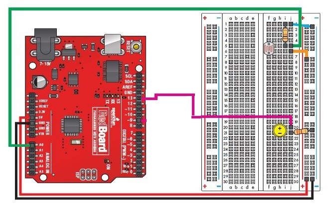

# Use an Arduino to make a night light that turns on automatically when its dark
In this lab you will build a circuit with one LED, one 10KΩ resistor, one 330Ω resistor and one photo resistor. You will then write a program for the Arduino using the [Scratch for Arduino](http://s4a.cat/) language. The program will turn the LED on when photo resistor is in the dark. This is the way street lights work, they have a photo resistor and are programmed to turn on when that photo resistor is in the dark.    

### Step 1: Build and test the circuit
You will need the following parts:
- 1 LED with two leads of any color. (**NOT** the white LED with **4** leads)
- 1 330Ω resistor
- 1 10KΩ resistor
- 1 photo resistor
- 6 jumper wires (the color of the wires doesn't matter, but you may find it convenient to use the same colors in the wiring diagram below) Connect the parts as shown below. Note that the direction of the resistors and jumper wires doesn't matter, but the LED must be connected in the correct direction.
   

### Step 2: Write some Scratch code
One finished program used the following blocks:
- 1 *forever loop* block
- 1 *digital on* block
- 1 *digital off* block
- 1 *if/else* block
- 1 *less than* operator block
- 1 *value of sensor Analog0* block

  
### Step 3: Save your program to *My Projects*
Choose *File | Save* and name your project something like `NightLight`. Save your project to your *My Projects* folder and click *Ok*.   

### Step 4: Submit the finished program
Have your teacher or a TA verify that you have a working program. Then, submit your finished program by uploading the `NightLight.sb` file to Google classroom. You should be able to find it in *My Documents | Scratch Projects*. If you worked with a partner, each partner should submit a copy of the finished program to Google classroom.   
